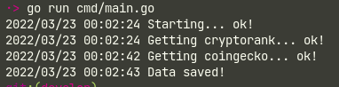

[](https://goreportcard.com/report/github.com/dreddsa5dies/parsecrypto)  

## Тестовое задание
<details>
  <summary>ТЗ</summary>

### Парсинг Cryptorank:
- Ресурс: [Cryptorank](https://cryptorank.io/)
- Данные для парсинга: Теги нескольких валют (первых трех)
- Метод парсинга: Любой
- Метод хранения полученных результатов: Запись в гугл таблицы (api) по запуску
- Количество столбцов 3: Наименование, Теги, Timestamp.
- Время на выполнение: Решает исполнитель

### Парсинг CoinGecko:
- Ресурс: [Coingecko](https://www.coingecko.com/)
- Данные для парсинга: Валюты, их стоимость относительно доллара
- Метод парсинга: Любой
- Метод хранения полученных результатов: Запись в гугл таблицы(api) по запуску. 
- Количество столбцов: Наименование, Цена, Timestamp. (Должно выводиться за один запрос 65! валют, вместе с ценами).
- Время на выполнение: Решает исполнитель

</details>

## Парсинг
<details>

  <summary>Выполнение задания</summary>

### Результат
[Ссылка](https://docs.google.com/spreadsheets/d/1ngUptjK8GwupzyG-_5uZTP_oCMCAtJ-v8F85lO0D7lw/edit?usp=sharing) на google sheet

### Запуск
```bin
git clone git@github.com:dreddsa5dies/parsecrypto.git
cd parsecrypto/cmd
go run main.go
```



Стоит уточнить, что проверка будет завершена с ошибкой, т.к. к API Google Sheet подключен только я. Но тут и проверять особо нечего.

### Парсинг Cryptorank:
Сделан с применением [goquery](https://github.com/PuerkitoBio/goquery).
Обычный поиск по тегам.

### Парсинг CoinGecko:
Сделан с применением [API](https://www.coingecko.com/en/api). Отобраны первые 65 валют из всех. Можно реализовать сортировку через добавление Len, Swap, Less и выводить топ валют (по какому угодно признаку).
К сожалению это free, поэтому приходится вставлять задержку по времени.

Простор для оптимизации просматривается, но «Преждевременная оптимизация — корень всех зол». (с) Дональд Кнут.

</details>

## License
This project is licensed under GPL license. Please read the [LICENSE](https:/github.com/dreddsa5dies/parsecrypto/tree/master/LICENSE.md) file.
